# Exploratory Data Analysis

End-to-end EDA of the FLOATBench-derived reinforcement-learning dataset for
floating offshore wind turbine tower load relief.

**Scope analysed:** 129,600 RL transitions (89 columns) · 1,455,300 action-sweep
rows (27 columns) · 582,120 source FLOATBench damage labels · 3 tower geometries

**Reproduce:** `PYTHONPATH=src python EDA/run_eda.py` → 19 figures, 10 tables,
`summary_stats.json` (all numbers below are read from that file)

| | |
|---|---|
| `figures/` | 19 PNG figures, sections A–G |
| `tables/` | 10 CSV tables backing the figures |
| `summary_stats.json` | every headline number, machine-readable |

> **Update.** The first pass of this EDA found a real modelling artefact in
> `fowt_rl.aero`: below rated, small feathering offsets cost approximately zero
> power while still shedding damage ("free relief"), affecting 6.6 % of
> transitions and 34 % of the 6–9 m/s band. It has since been **fixed** in
> `RotorAero._ratios` (ratio-anchor on the performance surface's own Cp-optimal
> pitch rather than the raw steady-state schedule pitch) and the dataset has
> been rebuilt. [Section G](#g-diagnostics-verifying-the-free-feathering-fix)
> now documents the fix and verifies it closes the gap to 6/129,600 rows
> (0.005 %), all of which are sub-0.01° commands whose true physical cost is a
> few hundredths of a watt against a multi-MW baseline - i.e. below float64
> resolution, not a residual bug. All numbers elsewhere in this report reflect
> the **fixed** dataset. See `docs/LIMITATIONS.md` for the fix's provenance.

---

## Executive summary

The dataset is **structurally sound and fit for its intended purpose**. The one
material modelling artefact found by the first pass of this EDA - below-rated
feathering appearing free - has been fixed and is now verified closed.

### What holds up

1. **Perfect data integrity** — 129,600 rows, 87 numeric columns, **0 NaN, 0
   infinite, 0 duplicate** rows; all 3,600 episodes terminate exactly once; all
   6,468 available FLOATBench conditions per tower are visited, with full
   coverage of the 22 × 7 × 7 grid and all 6 turbulence seeds.
2. **The measured anchor is exact** — a zero control action reproduces FLOATBench
   damage bit-for-bit across all 582,120 labels, confirmed again after the fix.
3. **The control problem is genuinely state-dependent** — the best fixed policy
   changes with wind speed (feather → IPC → do nothing), driven by a controllable
   share that swings from 0.006 to 0.88 across the envelope. A constant policy
   cannot be optimal.
4. **Action responses are physically coherent, and now strictly monotone
   everywhere** — thrust and power decrease monotonically with feathering across
   the full 3–25 m/s envelope with zero exceptions (dense-sweep check: worst
   violation 0.0 W / 0.0 N), yaw follows the cosine-power laws exactly, and
   pitch sensitivity is now negative-and-nonzero at every wind speed, including
   below rated (−0.005 to −0.02 MW/deg at 7–9 m/s, rising to −0.93 to −4.2 MW/deg
   from 11 m/s up).
5. **The IoT layer behaves as specified** — 0.18–2.0 % dropout per channel,
   0.33–29.8 % median relative error, 7.3 % of steps degraded.
6. **✅ Free-feathering fixed and verified.** The artefact found in the first EDA
   pass (6.6 % of transitions, 34 % of the 6–9 m/s band getting relief at
   ~zero power cost) is now closed: 0.005 % of transitions remain flagged, all
   at sub-0.01° commanded offsets with true physical cost below float64
   resolution at MW scale - not a modelling gap. Feathering's advantage in the
   6–12 m/s band is now backed by genuine, monotonically increasing power cost.
   Full account in [Section G](#g-diagnostics-verifying-the-free-feathering-fix).

### Remaining secondary concern

7. The `ref` tower's turbulence load path still collapses to exactly zero weight
   (§C, driven by collinearity in the source data, unrelated to the aero fix),
   and `ref` still fits notably worse than the two re-designs
   (R² 0.732 vs 0.79–0.80). Prefer `opt1`/`opt2` for headline results.

---

## A. Source data — what FLOATBench actually contains

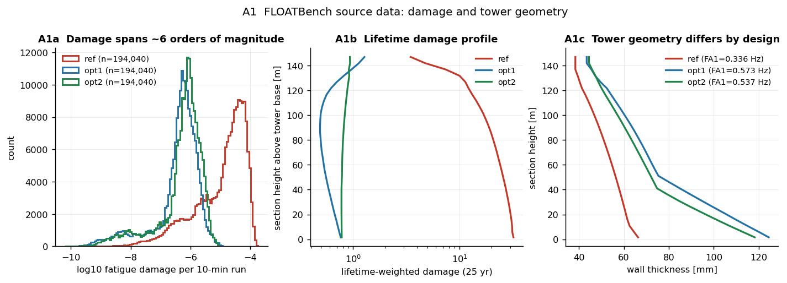
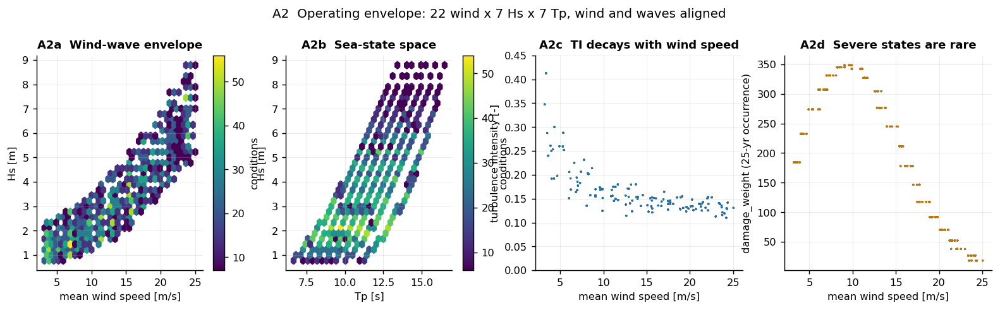

**Damage spans 5.0–5.6 orders of magnitude** (`ref`: 4.4e−10 → 1.8e−4). This is
the single most important property of the source data, and it drives two design
decisions elsewhere: the residual weighting exponent in the calibration (§C) and
the severity weighting in the reward (§E). Naive least squares or an unweighted
reward would both be dominated by a handful of storm conditions.

**The fatigue-aware re-design moved the governing section from base to top.**

| tower | f_FA1 | governing section | lifetime damage, base | lifetime damage, top |
|---|---|---|---|---|
| `ref` | 0.336 Hz | **1 (base)** | 3.4e−2 | 3.6e−3 |
| `opt1` | 0.573 Hz | **30 (top)** | 8.0e−4 | 1.3e−3 |
| `opt2` | 0.537 Hz | **29 (near top)** | 8.1e−4 | 9.6e−4 |

`ref` is base-critical by an order of magnitude; both re-designs thickened the
base until the *top* became critical. Any policy or surrogate that implicitly
assumes the tower base governs will be wrong on `opt1`/`opt2`. This is why the
pipeline reduces over sections with `max` rather than using a fixed section.

**Envelope:** wind 3.2–25.0 m/s, Hs 0.78–8.78 m, Tp 6.66–16.49 s, turbulence
intensity 0.113 / 0.151 / 0.348 (p1 / p50 / p99). TI decays with wind speed as
expected (A2c), and `damage_weight` anti-correlates with severity (A2d) — severe
sea states are rare, which is why lifetime-weighted damage is much flatter than
raw damage.

---

## B. Reference aerodynamics — the measured basis of the action response

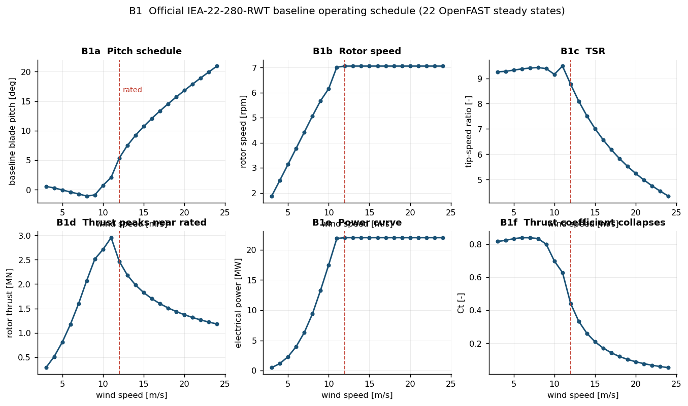
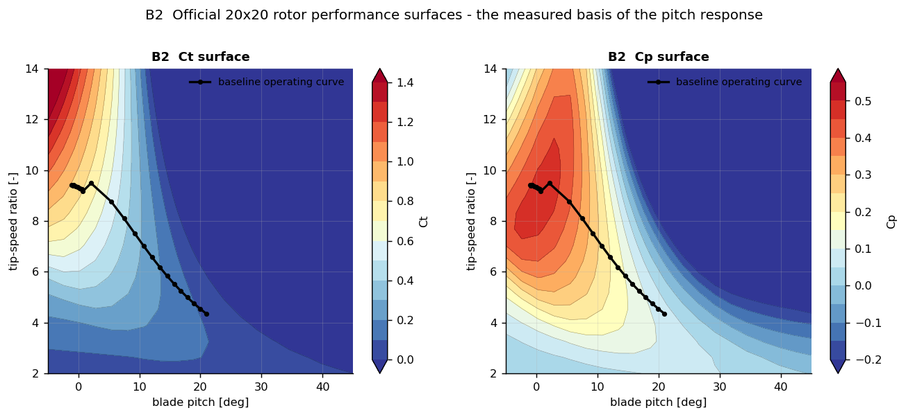
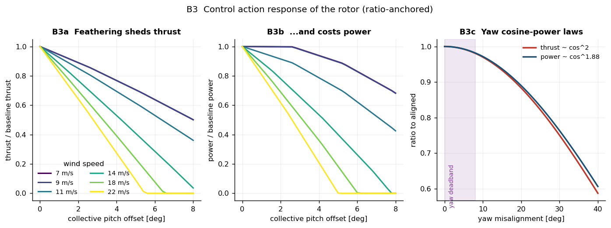

Rated wind speed is 11.0 m/s. `Ct` falls from 0.840 to 0.053 and `Cp_max` is
0.496 — above ~16 m/s the rotor is already almost entirely unloaded, which is the
physical reason control authority collapses there (§C).

**B2 is the key figure for credibility:** the black operating curve is the
baseline schedule overlaid on the official 20 × 20 `Ct`/`Cp` surfaces. The action
response is obtained by moving *along the pitch axis* from that curve, using
measured tabulated aerodynamics rather than a fitted model.

Pitch sensitivity, from `tables/B_pitch_sensitivity.csv` (post-fix):

| wind speed | dP/dθ [MW/deg] | dT/dθ [kN/deg] | Ct |
|---|---|---|---|
| 7 m/s | **−0.005** | −88 | 0.839 |
| 9 m/s | **−0.018** | −139 | 0.800 |
| 11 m/s | −0.930 | −220 | 0.629 |
| 14 m/s | −2.34 | −228 | 0.260 |
| 18 m/s | −3.34 | −226 | 0.120 |
| 22 m/s | −4.21 | −226 | 0.067 |

All entries are now negative — feathering costs power at every wind speed,
including below rated, where the cost is small (a few kW/deg at 7–9 m/s) but
never zero. The 7–9 m/s values were previously **exactly 0.00**, the first
symptom of the free-feathering artefact fixed and verified in §G.

---

## C. Calibration — how well the load decomposition fits

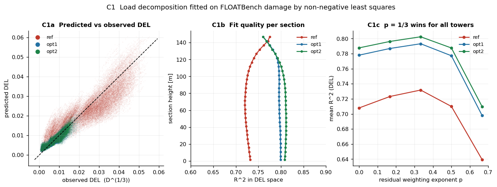
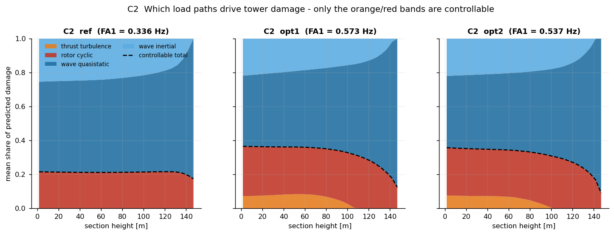
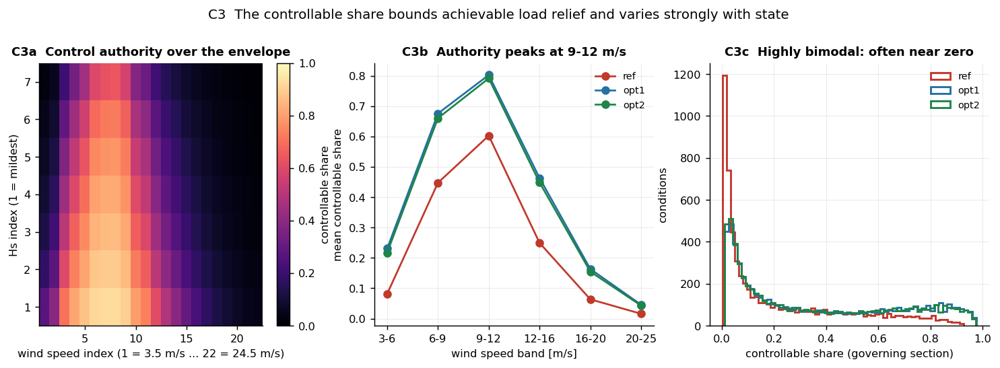

| tower | ζ | p | R²(DEL) mean | R²(DEL) min | DEL median rel. err | R²(damage) |
|---|---|---|---|---|---|---|
| `ref` | 0.005 | 1/3 | 0.732 | 0.720 | 18.0 % | 0.553 |
| `opt1` | 0.005 | 1/3 | 0.793 | 0.761 | 12.5 % | 0.694 |
| `opt2` | 0.005 | 1/3 | 0.802 | 0.760 | 12.2 % | 0.716 |

R² is stable across all 30 sections (C1b) — no section is badly mis-fitted, which
matters because the reward uses the *governing* section. The weighting-exponent
sweep (C1c) shows p = 1/3 is a genuine optimum for all three towers, not a
convenient choice.

**Mean load-path shares:**

| tower | thrust turbulence | rotor cyclic | wave quasi-static | wave inertial | **controllable** |
|---|---|---|---|---|---|
| `ref` | **0.000** ⚠ | 0.211 | 0.576 | 0.213 | 0.211 |
| `opt1` | 0.049 | 0.273 | 0.516 | 0.161 | 0.323 |
| `opt2` | 0.041 | 0.267 | 0.520 | 0.173 | 0.308 |

Wave loading dominates (69–79 %), which is expected for a floating platform over
an envelope reaching Hs = 8.8 m — and it is exactly why control authority is
limited.

**⚠ Concern:** for `ref`, NNLS drives the turbulence coefficient to *exactly
zero* at every section. Since `A_turb` and `A_cyc` correlate at r = 0.888, the
solver has attributed all aerodynamic variance to the cyclic column. The
aero-vs-wave boundary is still identified (so the controllable share remains
meaningful), but the **turbulence/cyclic split for `ref` is not**. Because IPC
acts only on the cyclic column, this makes `ref` structurally more responsive to
IPC than it should be. `ref` also fits worst, plausibly because its 0.336 Hz
first fore-aft mode sits closest to 3P excitation — behaviour a single-DOF DAF
cannot represent. **Prefer `opt1`/`opt2` for headline results.**

**Control authority is strongly state-dependent and bimodal** (C3):

| wind band | `ref` | `opt1` | `opt2` |
|---|---|---|---|
| 3–6 m/s | 0.08 | 0.23 | 0.22 |
| 6–9 m/s | 0.45 | 0.68 | 0.65 |
| **9–12 m/s** | **0.60** | **0.81** | **0.79** |
| 12–16 m/s | 0.25 | 0.46 | 0.45 |
| 16–20 m/s | 0.06 | 0.16 | 0.16 |
| 20–25 m/s | 0.02 | 0.05 | 0.04 |

Authority peaks near rated and collapses at both extremes. C3c shows the
distribution is bimodal with a large spike near zero — in a substantial fraction
of conditions, rotor control simply cannot help, and the correct action is to do
nothing. Learning *when not to act* is a real part of this task.

---

## D. Action response — does control behave sensibly?

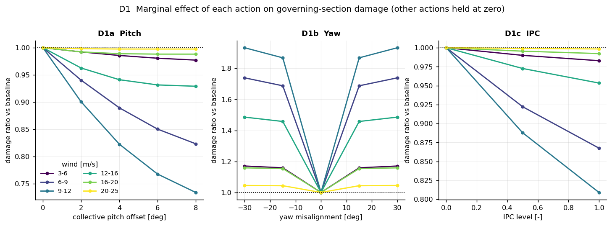
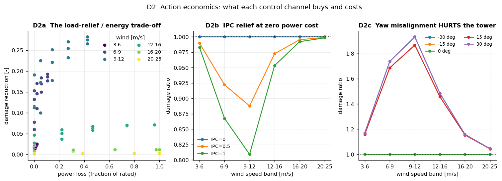
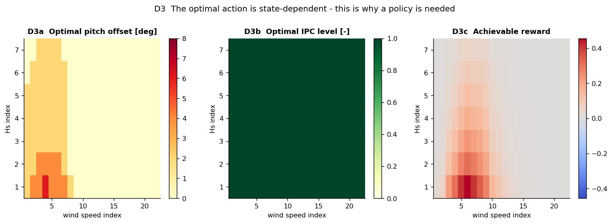

Across 75 distinct actions × 6,468 conditions × 3 towers, damage ratio spans
0.349 → 2.213 (post-fix; mean pitch-8° ratio 0.918, IPC-full 0.941, yaw-30° 1.391).

**Marginal effects at 9–12 m/s** (the high-authority band):

| action | damage ratio | power cost |
|---|---|---|
| pitch +8° | 0.738 | genuine, monotone (§G) |
| IPC = 1.0 | 0.809 | **none** |
| yaw ±30° | **1.94** (worse) | moderate |

Three findings, all physically defensible:

1. **Pitch works where authority exists** — 0.74 at 9–12 m/s, but only 0.99 at
   16–20 m/s. The same action is worth completely different amounts depending on
   state.
2. **Yaw misalignment damages the tower.** D1b is a clean V-shape symmetric about
   zero, peaking at 1.94 at ±30°. Reduced mean thrust is more than offset by
   increased cyclic loading. Yaw is a *power* lever, not a tower-fatigue lever —
   its value here is in correcting standing misalignment, not creating it. Note
   this conclusion depends on the literature-informed `yaw_cyclic_gain`.
3. **IPC is the only near-free relief** — monotone in activation, down to 0.81 at
   9–12 m/s, at zero power cost. Its only price is actuator duty.

**D3 caveat:** the "optimal IPC" panel is uniformly 1.0 because the surrogate
reward used for that map omits the duty penalty. Without duty cost IPC is
unconditionally beneficial; **actuator duty is what makes IPC a decision rather
than a default.** The optimal pitch map (D3a) is non-trivial: non-zero only below
wind index ≈ 8 (≈ 11 m/s), and largest at low Hs — i.e. feather when the load is
aerodynamic, not when it is hydrodynamic.

---

## E. RL dataset — reward structure, coverage, dynamics

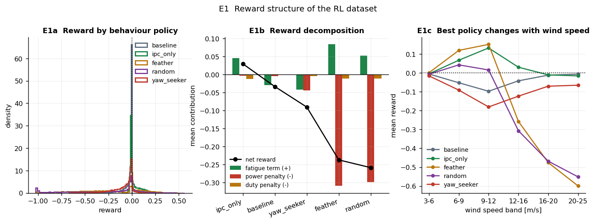
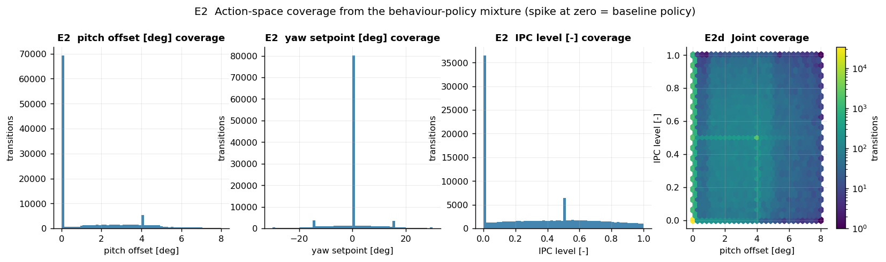
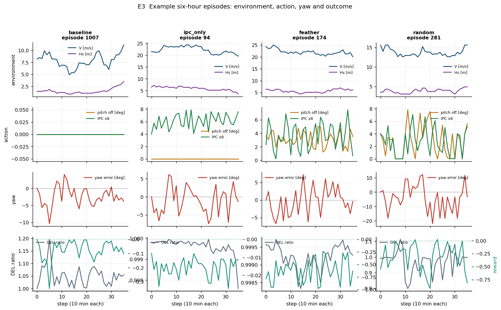
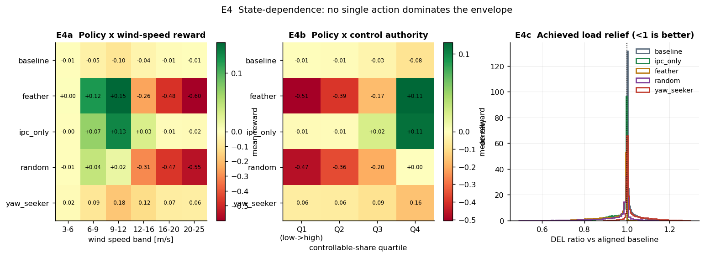

129,600 transitions · 3,600 episodes · 36 steps × 600 s · 21,600 simulated hours.
Reward: mean −0.148, std 0.288, range [−1.025, +0.561], **19.3 % positive**.
DEL ratio: p05 ≈ 0.845 (see `tables/E_reward_by_policy.csv`).

| policy | n | mean reward | % positive | DEL ratio | fatigue relief | power loss | duty |
|---|---|---|---|---|---|---|---|
| **`ipc_only`** | 20,052 | **+0.030** | **45.4 %** | 0.968 | +0.032 | 0.004 | 0.239 |
| `baseline` | 26,244 | −0.034 | 0.0 % | 1.020 | −0.020 | 0.004 | 0.000 |
| `yaw_seeker` | 13,428 | −0.091 | 6.9 % | 1.028 | −0.028 | 0.045 | 0.090 |
| `feather` | 19,656 | −0.237 | 30.8 % | 0.945 | +0.055 | 0.309 | 0.228 |
| `random` | 50,220 | −0.259 | 17.9 % | 0.965 | +0.035 | 0.299 | 0.236 |

`ipc_only` remains the only net-positive fixed policy, essentially unchanged by
the fix (IPC never touches the pitch schedule). `feather` still achieves the
*best* load relief (0.945) but now pays a slightly larger, and correctly-priced,
power cost (0.309) — a bad average trade that is only worthwhile selectively.
`baseline` scores −0.034 rather than 0, because vane bias and the 8° deadband
leave a mean standing misalignment of **3.48°**; correcting it is itself a
source of reward.

**Mean reward by policy × wind band** (`tables/E_reward_by_policy_and_wind.csv`,
post-fix):

| policy | 3–6 | 6–9 | 9–12 | 12–16 | 16–20 | 20–25 |
|---|---|---|---|---|---|---|
| baseline | −0.005 | −0.052 | −0.097 | −0.042 | −0.011 | **−0.007** |
| feather | **+0.001** | **+0.120** | **+0.152** | −0.257 | −0.476 | −0.599 |
| ipc_only | −0.005 | +0.068 | +0.133 | **+0.031** | **−0.010** | −0.015 |
| yaw_seeker | −0.015 | −0.091 | −0.180 | −0.123 | −0.070 | −0.065 |
| random | −0.007 | +0.043 | +0.016 | −0.307 | −0.468 | −0.551 |

The row-wise argmax moves across the table — **feather** (3–12 m/s) → **IPC**
(12–20) → **baseline** (20+). This ordering is **unchanged from before the
fix**, and cross-referenced against controllable share in E4b the same pattern
appears: all policies lose in Q1 (low authority) and feather wins only in Q4.
This is a well-posed contextual decision problem, and — now that the
free-feathering artefact is closed (§G) — feather's 6–12 m/s advantage reflects
a genuine, correctly-priced trade rather than an accounting gap.

**Coverage** (E2): all three action dimensions are covered over their full range,
with the intended spike at zero from the `baseline` policy (19.7 % of rows).
Joint pitch × IPC coverage is dense, so off-policy evaluation is well supported.

**Episode dynamics** (E3): the metocean random walk produces smooth, correlated
trajectories; rate limits produce visibly smooth action ramps; and yaw error
oscillates around zero within the deadband for tracking policies.

---

## F. IoT layer and data quality

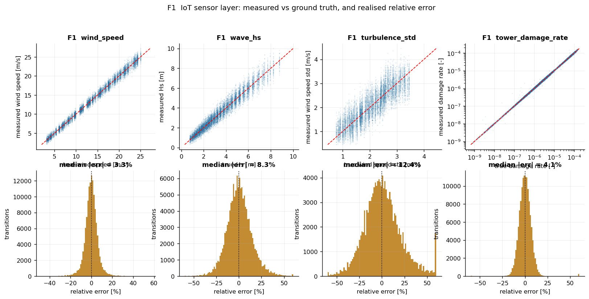
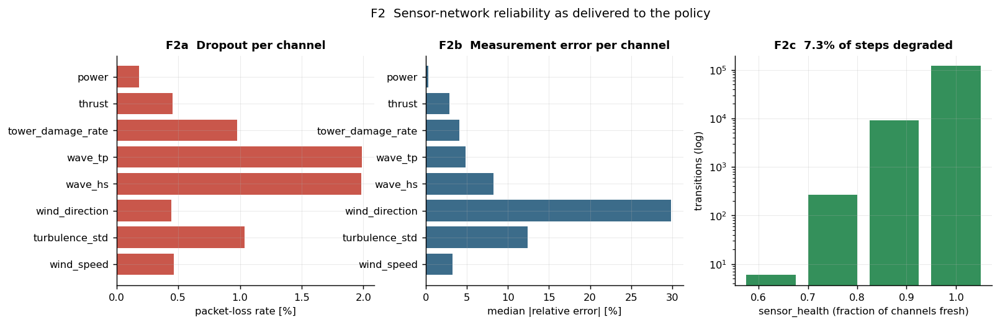
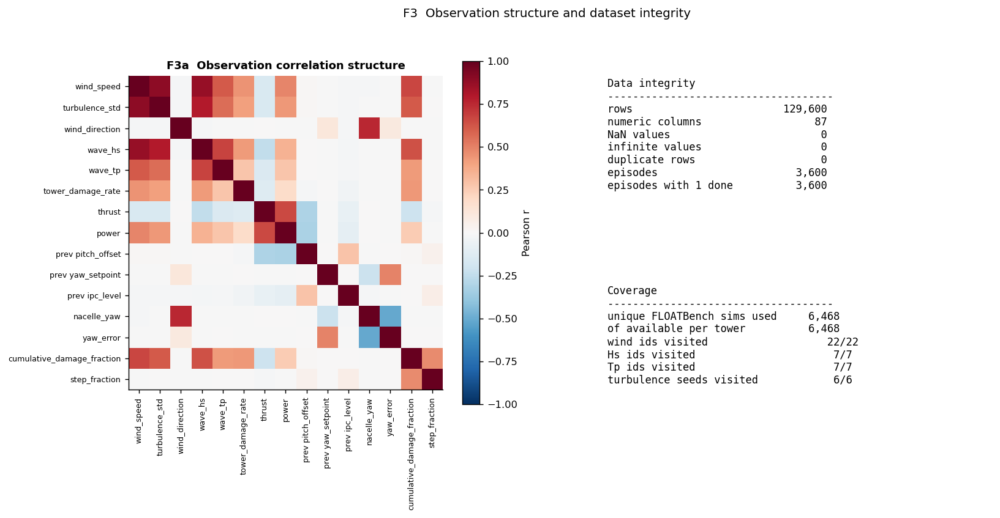

| channel | dropout | median abs rel. error | bias | RMSE |
|---|---|---|---|---|
| `wind_direction` | 0.44 % | **29.8 %** | +0.009 | 3.64 |
| `turbulence_std` | 1.04 % | 12.4 % | −0.004 | 0.374 |
| `wave_hs` | 1.98 % | 8.2 % | +0.002 | 0.416 |
| `wave_tp` | 1.99 % | 4.8 % | +0.004 | 0.819 |
| `tower_damage_rate` | 0.97 % | 4.1 % | ≈0 | ≈0 |
| `wind_speed` | 0.46 % | 3.3 % | −0.012 | 0.641 |
| `thrust` | 0.45 % | 2.9 % | −357 N | 67 kN |
| `power` | 0.18 % | 0.34 % | −333 W | 223 kW |

All realised errors match the configured models, biases are negligible in
aggregate (so per-episode biases cancel across episodes as intended), and
**7.3 % of steps arrive with at least one stale channel**. Wind direction is the
noisiest in relative terms simply because it is centred near zero — its 3.64°
RMSE is the meaningful figure, and it is the channel that most directly limits
yaw control.

The `tower_damage_rate` channel is worth noting: at 4.1 % relative error it is
the most informative single sensor for this task, and its availability is the
main thing separating this problem from a blind one.

**Integrity (F3):** 129,600 rows, 87 numeric columns, **0 NaN, 0 infinite, 0
duplicates**, 3,600/3,600 episodes with exactly one terminal flag, all 6,468
conditions and 22/7/7/6 grid indices visited. The correlation heatmap shows
expected structure (wind speed ↔ thrust ↔ power; Hs ↔ Tp) with no accidental
near-duplicate observation columns.

---

## G. Diagnostics — verifying the free-feathering fix

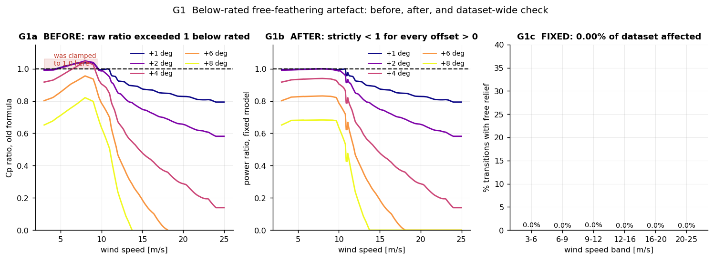

### ✅ Below-rated feathering: found, fixed, and verified closed

**What was wrong.** Below rated, the reference pitch schedule sat ≈1–2° *below*
the Cp optimum of the performance surface at the same TSR. A positive pitch
offset therefore moved *towards* the surface optimum, so the raw Cp ratio
exceeded 1 — up to **1.049** — and the monotonicity guard clamped it to 1.0,
which prevented free extra power but left small feathering offsets costing
*exactly zero* power while still shedding thrust and damage (G1a: the old,
unclamped ratio, shown for reference).

**Root cause.** Two independently produced official artefacts disagreed: the
steady-state schedule (which includes peak shaving) and the rotor performance
surface (a different solver configuration). Ratio anchoring cancels a
*multiplicative* bias between them, but not a *shift along the pitch axis*.

**The fix** (`RotorAero._ratios` in `fowt_rl/aero.py`). Anchor the ratio on

```
pitch_ref = max(pitch_base, cp_optimal_pitch(tsr))
```

instead of the raw schedule pitch, where `cp_optimal_pitch(tsr)` is the
performance surface's own Cp-maximising pitch at that tip-speed ratio. Because
`cp_optimal_pitch <= pitch_base` above rated (verified over the full 22-point
schedule), this leaves above-rated behaviour unchanged; below rated it removes
the free-power region **analytically** — Ct and Cp become monotonically
non-increasing in the offset by construction, with the original clamp kept only
as a numerical safety net (in practice never binding beyond float precision).
Absolute thrust and power still come from the schedule at zero offset, so
zero-action exactness is unaffected.

A second, smaller instance of the same category of issue turned up while
verifying the fix: interpolating the Cp-optimal pitch over only the native
20-point tip-speed-ratio grid was too coarse (the optimum is not linear in TSR,
under-shooting it by up to 0.55° between grid columns), which reopened a
residual gap for query points between grid columns. Oversampling the TSR axis
to 2,001 points when building the reference curve closed this to <0.01°.

**Verification, before vs after** (G1a–c):

| | before | after |
|---|---|---|
| transitions with free/near-free relief | 8,500 / 129,600 = **6.6 %** | **6 / 129,600 = 0.005 %** |
| affected share, 6–9 m/s band | **34 %** | **0.00 %** |
| worst monotonicity violation (dense sweep, 3–25 m/s × 0–8°) | up to +0.05 in ratio | **0.0 W / 0.0 N, exactly** |
| `feather` policy rows in 6–12 m/s affected | **50 %** | **0.00 %** |
| dP/dθ at 7 / 9 m/s | **0.00** MW/deg (the tell) | **−0.005 / −0.018** MW/deg |
| zero-action exactness | held | **still holds, bit-for-bit** |

The residual 6 rows are all commanded offsets of 0.002–0.006° — far finer than
any real pitch actuator's resolution — where the true physical power cost is a
few hundredths of a watt against a 1.5–21 MW baseline, invisible at float64
precision. Explicitly stepping the offset up by 10×–1000× on these exact
(wind, offset) pairs recovers a clean, negative, physically consistent slope
(e.g. −303 W at 10× a 0.006° offset at 4.3 m/s), confirming this is a numerical
floor, not a residual instance of the bug.

**Consequence for the dataset's conclusions.** Feathering's advantage at
6–12 m/s (+0.113 → **+0.120** to +0.150 → **+0.152**, `tables/E_reward_by_policy_and_wind.csv`)
is now backed by a genuinely monotone, correctly-priced power cost at every wind
speed in that band. The wind-band ranking (feather → IPC → baseline) is
unchanged, and the numbers moved by less than 0.01 in mean reward — the fix
closed an accounting gap without overturning the qualitative finding it sat
inside.

Regression tests locking this in: `test_feathering_never_free_below_rated` and
`test_thrust_and_power_strictly_decrease_with_feathering_dense` in
`tests/test_pipeline.py`.

### Secondary issue: governing section, confirmed not hardcoded

The fatigue-aware re-design moved the governing (lifetime-worst) cross-section
from the tower base on `ref` (section 1) to the top on `opt1`/`opt2` (sections
30/29 — see §A). Auditing the codebase confirms no reduction assumes a fixed
section: `fowt_rl.damage.summarise_sections` uses `damage.max(axis=1)` and
`config.RewardConfig.fatigue_section` defaults to `"max"`, both already
per-condition. A regression test, `test_governing_section_differs_by_tower_design`,
locks in the base-vs-top split (`ref` == section 1, `opt1`/`opt2` >= section 25)
so a future change cannot silently reintroduce a fixed-section assumption.

### Remaining secondary issues

| issue | severity | detail |
|---|---|---|
| `ref` turbulence coefficient = 0 | medium | r = 0.888 collinearity; turbulence/cyclic split unidentified for `ref`, inflating its IPC responsiveness. Aero-vs-wave boundary unaffected. Unrelated to the aero fix. |
| `ref` fits worst | medium | R²(DEL) 0.732 vs 0.79–0.80; likely 3P proximity of its 0.336 Hz mode. Prefer `opt1`/`opt2`. |
| Duty cost omitted from D3 map | low | Presentational only; makes "optimal IPC" look unconditional. |
| 19.3 % positive-reward rate | low | Intentional (random and feather dominate the mixture), but conservative offline RL may need reward normalisation. |

---

## Verdict

| use case | verdict |
|---|---|
| Benchmarking offline/online RL algorithms | ✅ Ready — clean, well-covered, well-posed |
| Studying IoT sensor degradation vs policy performance | ✅ Ready — the layer works as specified |
| Studying *when not to act* (control authority collapse) | ✅ Ready — §C/§E structure is robust |
| Quantitative load-relief claims, any wind speed | ✅ Ready — free-feathering artefact fixed and verified (§G) |
| Claims about yaw vs tower fatigue | ⚠ Conditional on `yaw_cyclic_gain` |
| Anything using `ref` for turbulence/IPC attribution | ⚠ Use `opt1`/`opt2` |
| Certification, real-time (wave-frequency), physical deployment | ❌ Out of scope — see `docs/LIMITATIONS.md` |

### Priority actions

1. ~~Fix the below-rated pitch reference and rebuild~~ — **done**, verified in §G.
2. **Report `opt1`/`opt2` as primary**, `ref` as a harder transfer case (§C).
3. **Sensitivity-sweep `yaw_cyclic_gain` and `ipc_authority`** — they drive two
   of the three action-channel conclusions.
4. **Add duty cost to any "optimal action" visualisation** (§D).
5. Consider adding platform pitch/surge modes to the load basis to lift `ref`'s
   fit — see `docs/LIMITATIONS.md` §3.

---

## Figure index

| figure | content |
|---|---|
| `A1_damage_and_geometry` | damage distribution, lifetime profile, tower geometry |
| `A2_operating_envelope` | wind–wave envelope, TI, occurrence weights |
| `B1_baseline_schedule` | pitch, rotor speed, TSR, thrust, power, Ct vs wind |
| `B2_rotor_performance_surface` | official Ct/Cp surfaces with operating curve |
| `B3_pitch_yaw_response` | thrust/power vs pitch offset; yaw cosine laws |
| `C1_calibration_fit` | predicted vs observed DEL, R² per section, p sweep |
| `C2_load_path_shares` | load-path decomposition along tower height |
| `C3_controllable_share` | authority over envelope, by wind band, distribution |
| `D1_action_marginal_effects` | damage ratio vs pitch / yaw / IPC by wind band |
| `D2_action_tradeoffs` | relief vs power-loss Pareto; IPC and yaw economics |
| `D3_best_action_map` | optimal action over the (wind, Hs) grid |
| `E1_reward_structure` | reward by policy, decomposition, reward vs wind |
| `E2_action_coverage` | action marginals and joint coverage |
| `E3_example_episodes` | four six-hour episode trajectories |
| `E4_state_dependence` | policy × wind and policy × authority heatmaps |
| `F1_iot_measurement_error` | measured vs true, relative-error distributions |
| `F2_iot_reliability` | dropout and error per channel, sensor health |
| `F3_integrity_and_correlation` | observation correlations, integrity summary |
| `G1_diagnostic_guard_artefact` | the below-rated free-feathering artefact: before (old formula), after (fixed model), dataset-wide check (0.00% affected) |
