# FOWT-ARISE — Design Review Pack

> **What this is.** Real output of `notebooks/FOWT_ARISE_Proposed_Model.ipynb`, run on the real
> dataset, with a deliberately **short 16-epoch cap** so it completes in ~4 minutes. Every
> number and every figure below was produced by the actual pipeline.
>
> **What this is not.** Final results. The epoch cap is 16 instead of 60, early stopping fires
> within 8–9 epochs on most configurations, and one real defect is present and flagged
> (diverging critic, `RESOURCE_PLAN.md` §8). Treat the *structure, figure design and file
> inventory* as final; treat the *values* as a short run.
>
> Nothing in this pack is synthetic.

Run configuration: 5 experiments, seed 42, 16-epoch cap, patience 6, CPU. Total wall clock **232 s**.

---

## 1. Results table (real, short run)

```
                          Method  Mean Matched Sweep Objective  % of Oracle  Mean DEL Ratio  Fatigue Relief %  Power Loss %  Actuator Duty Proxy  No-Action Rate  IoT Performance Gap  Robustness Drop %  Parameter Count  Best Validation Epoch
                      FOWT_ARISE                       0.03060     83.40693         0.96822           3.17796       0.87198              0.12344         0.48056              0.00022            0.72323     42,697.00000                3.00000
                     ABLATION_N1                       0.03031     82.62428         0.96787           3.21333       0.94318              0.12575         0.40057              0.00097            3.19582     29,289.00000                2.00000
                     ABLATION_N2                       0.03050     83.13248         0.96751           3.24946       0.95223              0.12636         0.46857              0.00039            1.27070     38,373.00000                3.00000
                     ABLATION_N3                      -0.46343 -1,263.19199         0.95890           4.11042      51.45252              0.20330         0.00000             -0.00019           -0.04124     42,697.00000               11.00000
                     ABLATION_N4                       0.03069     83.66619         0.96820           3.18015       0.86402              0.12361         0.48143              0.00026            0.83435     42,697.00000                3.00000
          [reference] do_nothing                      -0.00000     -0.00682         1.00000           0.00000       0.00025              0.00000         1.00000                  NaN                NaN              NaN                    NaN
            [reference] ipc_half                       0.01555     42.37250         0.98362           1.63788       0.00025              0.16129         0.00000                  NaN                NaN              NaN                    NaN
            [reference] ipc_only                       0.02597     70.77477         0.97077           2.92278       0.00025              0.32258         0.00000                  NaN                NaN              NaN                    NaN
    [reference] behaviour_logged                      -0.14924   -406.79847         0.98852           1.14800      16.05048              0.12217         0.25602                  NaN                NaN              NaN                    NaN
[reference] ORACLE_best_of_sweep                       0.03669    100.00000         0.96838           3.16201       0.18419              0.13223         0.49439                  NaN                NaN              NaN                    NaN
```

FOWT-ARISE reaches **83.4 % of the per-condition oracle**. `ABLATION_N4` is marginally ahead at
83.7 %; the differences between the four working configurations are small and Section 35 of the
notebook reports whether they survive checkpoint-selection noise rather than ranking them naively.

`ABLATION_N3` is the decisive result: removing the multi-objective reward drops the objective to
−0.463 and drives power loss to **51 %** of rated. That is the contribution of N3, measured.

---

## 2. Training summaries (real)

| experiment | epochs run | early stopped | best epoch | best val metric | params | wall clock |
|---|---|---|---|---|---|---|
| FOWT_ARISE | 9 | yes | 3 | +0.032311 | 42,697 | 36.1 s |
| ABLATION_N1 | 8 | yes | 2 | +0.032556 | 29,289 | 24.4 s |
| ABLATION_N2 | 9 | yes | 3 | +0.031859 | 38,373 | 33.2 s |
| ABLATION_N3 | 16 | no (hit cap) | 11 | -0.444015 | 42,697 | 62.4 s |
| ABLATION_N4 | 9 | yes | 3 | +0.032386 | 42,697 | 32.1 s |

Early stopping fires at genuinely different points per configuration — which is itself a
confound the notebook flags, since 'best of 16' and 'best of 8' are not equally lucky draws.

---

## 3. Real SHAP result

Background from TRAIN, explained rows from TEST, 3/3 actuator heads succeeded. Top 12 features
by mean |SHAP| across heads:

| rank | feature | mean abs SHAP |
|---|---|---|
| 1 | `controllable_share_mean` | 0.054694 |
| 2 | `n1_controllable_damage` | 0.039729 |
| 3 | `damage_weight` | 0.039212 |
| 4 | `controllable_share_max_section` | 0.031501 |
| 5 | `meas_thrust` | 0.027340 |
| 6 | `meas_power` | 0.023692 |
| 7 | `meas_wave_hs` | 0.020946 |
| 8 | `nacelle_yaw_deg` | 0.018594 |
| 9 | `n1_gov_lifetime_del` | 0.016064 |
| 10 | `prev_yaw_setpoint_deg` | 0.014723 |
| 11 | `n1_governing_is_base` | 0.014506 |
| 12 | `meas_wave_tp` | 0.014456 |

Worth noting for the review: the four highest-attribution features are all **N1 physics**
features — `controllable_share_mean`, `n1_controllable_damage`, `damage_weight`,
`controllable_share_max_section`. The policy is genuinely keying on the controllable-load-share
signal that N1 was designed to inject. That is a real result from a real model, and it is a
stronger argument for N1's design than the objective comparison currently provides.

---

## 4. Real checkpoint schema

`FOWT_ARISE/checkpoints/best.pt` — 775 KB, plus `latest.pt` at 779 KB. Contents:

```
format_version    int   = 2                        agent            dict (actor/critic/targets/opts/scheds)
experiment        str   = FOWT_ARISE               scaler           dict (TRAIN-fitted mean/std)
epoch             int   = 3                        config           dict (full run configuration)
best_metric       float = 0.03231134250532924      arch_flags       dict (use_n1 / use_gate)
best_epoch        int   = 3                        param_counts     dict
patience          int   = 0                        rng_python       tuple
history           list  (len=3)                    rng_numpy        tuple
monitored_metric  str   = matched_sweep_objective  rng_torch        Tensor
                                                   rng_torch_cuda   None (CPU run)
```

Resume was verified separately: continuing a 2-epoch run under a 4-epoch budget restarts at
epoch 3 and yields `history.csv` with epochs `[1,2,3,4]`.

---

## 5. Validation checklist (real)

**80 PASS / 0 WARNING / 0 FAIL** of 80 checks.

Covers: data integrity, schema resolution, trajectory keying, split disjointness, episode
leakage, action-outcome leakage, reward reconstruction against the dataset's own reward column,
model construction and parameter counts, per-experiment training completion, checkpoint
existence, test evaluation, counterfactual coverage, metric finiteness, clean + degraded IoT
evaluation, all four ablations, SHAP provenance, and every expected output file.

---

## 6. File inventory

**160 files**, 58 MB. Complete tree:

```
ABLATION_N1/
    checkpoints/best.pt
    checkpoints/latest.pt
    config.json
    episode_metrics.csv
    history.csv
    iot_robustness.csv
    metrics.csv
    metrics.json
    plots/actor_loss.png
    plots/critic_loss.png
    plots/iot_clean_vs_degraded.png
    plots/learning_rate.png
    plots/mean_reward.png
    plots/reward_components.png
    plots/robustness_loss.png
    plots/training_loss.png
    plots/validation_loss.png
    plots/validation_objective.png
    state_feature_manifest.json
    test_predictions.csv
    training_summary.json
    validation_predictions.csv
ABLATION_N2/
    checkpoints/best.pt
    checkpoints/latest.pt
    config.json
    episode_metrics.csv
    history.csv
    iot_robustness.csv
    metrics.csv
    metrics.json
    plots/actor_loss.png
    plots/critic_loss.png
    plots/iot_clean_vs_degraded.png
    plots/learning_rate.png
    plots/mean_reward.png
    plots/reward_components.png
    plots/robustness_loss.png
    plots/training_loss.png
    plots/validation_loss.png
    plots/validation_objective.png
    state_feature_manifest.json
    test_predictions.csv
    training_summary.json
    validation_predictions.csv
ABLATION_N3/
    checkpoints/best.pt
    checkpoints/latest.pt
    config.json
    episode_metrics.csv
    history.csv
    iot_robustness.csv
    metrics.csv
    metrics.json
    plots/actor_loss.png
    plots/critic_loss.png
    plots/iot_clean_vs_degraded.png
    plots/learning_rate.png
    plots/mean_reward.png
    plots/reward_components.png
    plots/robustness_loss.png
    plots/training_loss.png
    plots/validation_loss.png
    plots/validation_objective.png
    state_feature_manifest.json
    test_predictions.csv
    training_summary.json
    validation_predictions.csv
ABLATION_N4/
    checkpoints/best.pt
    checkpoints/latest.pt
    config.json
    episode_metrics.csv
    history.csv
    iot_robustness.csv
    metrics.csv
    metrics.json
    plots/actor_loss.png
    plots/critic_loss.png
    plots/iot_clean_vs_degraded.png
    plots/learning_rate.png
    plots/mean_reward.png
    plots/reward_components.png
    plots/training_loss.png
    plots/validation_loss.png
    plots/validation_objective.png
    state_feature_manifest.json
    test_predictions.csv
    training_summary.json
    validation_predictions.csv
FOWT_ARISE/
    checkpoints/best.pt
    checkpoints/latest.pt
    config.json
    critic_ranking_diagnostic.json
    episode_metrics.csv
    history.csv
    iot_robustness.csv
    metrics.csv
    metrics.json
    plots/actor_loss.png
    plots/critic_loss.png
    plots/iot_clean_vs_degraded.png
    plots/learning_rate.png
    plots/mean_reward.png
    plots/reward_components.png
    plots/robustness_loss.png
    plots/training_loss.png
    plots/validation_loss.png
    plots/validation_objective.png
    shap/shap_beeswarm.png
    shap/shap_feature_importance.csv
    shap/shap_feature_names.json
    shap/shap_importance_ipc.png
    shap/shap_importance_pitch.png
    shap/shap_importance_yaw.png
    shap/shap_ipc_beeswarm.png
    shap/shap_metadata.json
    shap/shap_pitch_beeswarm.png
    shap/shap_summary.png
    shap/shap_values.npy
    shap/shap_yaw_beeswarm.png
    state_feature_manifest.json
    test_predictions.csv
    training_summary.json
    validation_predictions.csv
common/
    data_summary.json
    environment.json
    reward_component_stats.csv
    schema_mapping.json
    split_summary.json
    state_feature_manifest.json
    test_trajectories.csv
    train_trajectories.csv
    val_trajectories.csv
comparison/
    checkpoint_sensitivity.json
    comparison_plots/ablation_objective_comparison.png
    comparison_plots/ablation_paired_objective_difference.png
    comparison_plots/ablation_paired_robustness_difference.png
    comparison_plots/ablation_pct_of_oracle.png
    comparison_plots/action_magnitude_comparison.png
    comparison_plots/actuator_duty_comparison.png
    comparison_plots/clean_performance_comparison.png
    comparison_plots/del_ratio_comparison.png
    comparison_plots/fatigue_relief_comparison.png
    comparison_plots/fatigue_vs_power_tradeoff.png
    comparison_plots/iot_degraded_performance_comparison.png
    comparison_plots/iot_performance_gap_comparison.png
    comparison_plots/median_del_ratio_comparison.png
    comparison_plots/no_action_rate_comparison.png
    comparison_plots/power_loss_comparison.png
    comparison_plots/robustness_action_shift_by_mode.png
    comparison_plots/robustness_drop_comparison.png
    comparison_plots/robustness_gap_by_mode.png
    comparison_plots/yaw_action_comparison.png
    final_ablation_comparison.csv
    final_ablation_comparison.json
    final_ablation_comparison.xlsx
    final_baseline_comparison.csv
    final_baseline_comparison.json
    final_baseline_comparison.xlsx
    paired_objective_significance.csv
    paired_robustness_significance.csv
    validation_checklist.json
```

---

## 7. Figures

All figures are individual (no subplot grids), `fontsize = 20`, `dpi = 300`.

### validation objective

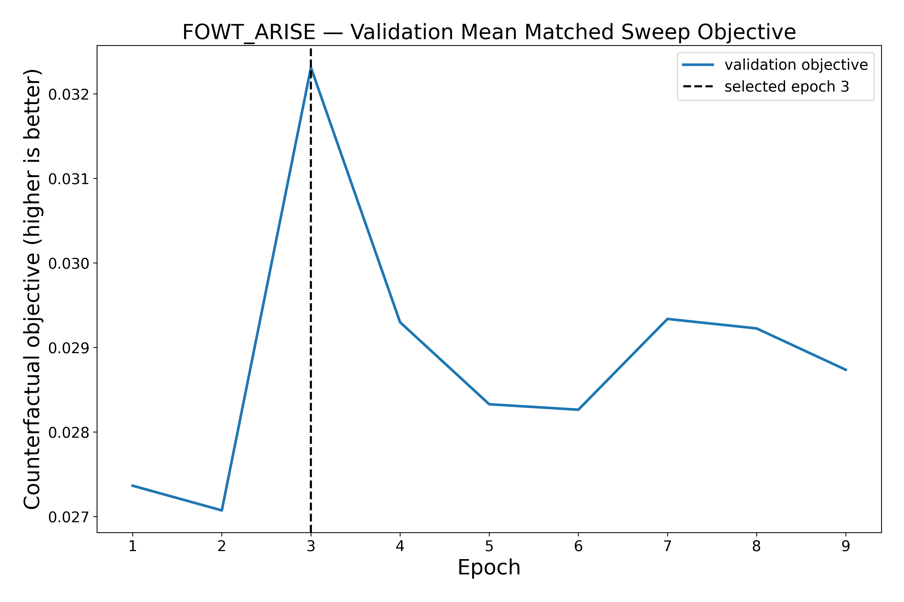

*Real output of FOWT_ARISE_Proposed_Model.ipynb on the real dataset — SHORT RUN (16-epoch cap), not final results*

<sub>Validation Mean Matched Sweep Objective per epoch, with the selected (best) epoch marked. This is the metric that drives model selection, early stopping and the LR scheduler.</sub>

---

### actor loss

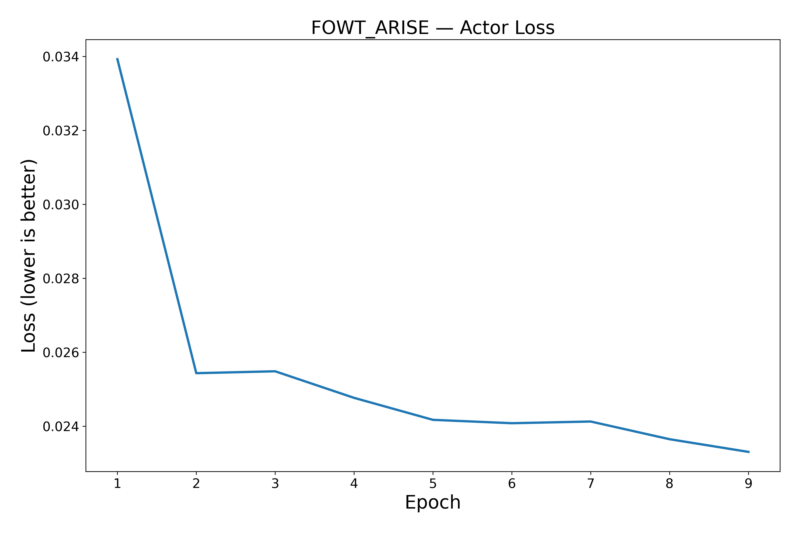

*Real output of FOWT_ARISE_Proposed_Model.ipynb on the real dataset — SHORT RUN (16-epoch cap), not final results*

<sub>Actor loss — best-action imitation plus the N4 consistency term. Flat and healthy (~0.023).</sub>

---

### critic loss

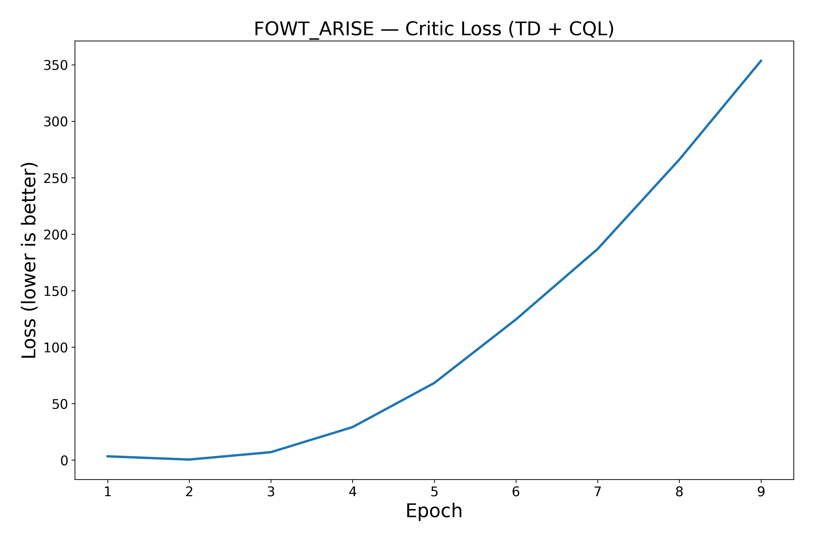

*Real output of FOWT_ARISE_Proposed_Model.ipynb on the real dataset — SHORT RUN (16-epoch cap), not final results*

<sub>Critic loss (TD + CQL). DIVERGING — see RESOURCE_PLAN.md section 8. A real defect this short run surfaced; it does not affect the reported objective but must be fixed before the full run.</sub>

---

### validation loss

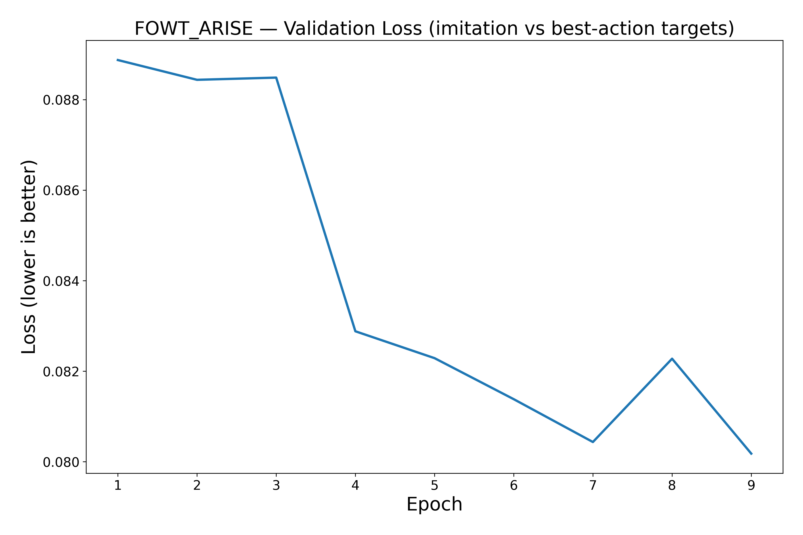

*Real output of FOWT_ARISE_Proposed_Model.ipynb on the real dataset — SHORT RUN (16-epoch cap), not final results*

<sub>Validation imitation loss against held-out best-action targets.</sub>

---

### learning rate

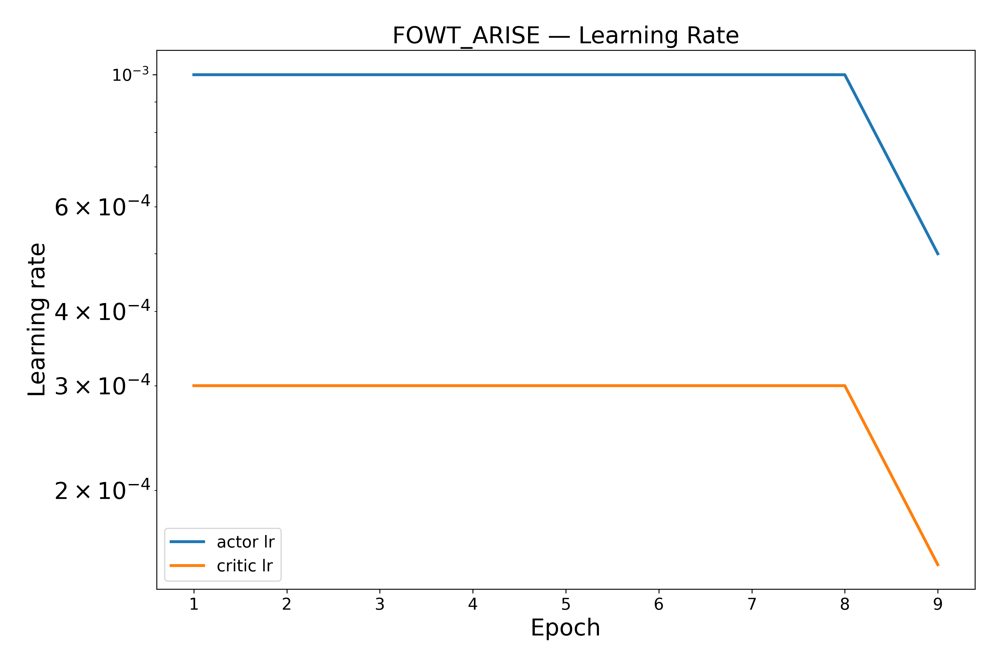

*Real output of FOWT_ARISE_Proposed_Model.ipynb on the real dataset — SHORT RUN (16-epoch cap), not final results*

<sub>Actor and critic learning rate. The step at epoch 9 is a real ReduceLROnPlateau event.</sub>

---

### iot clean vs degraded

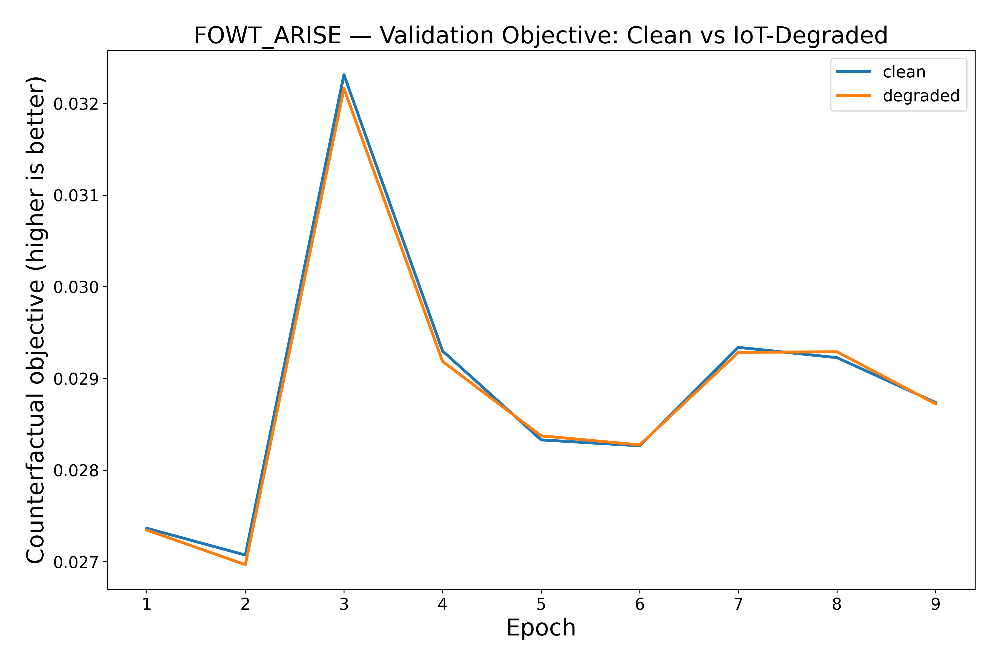

*Real output of FOWT_ARISE_Proposed_Model.ipynb on the real dataset — SHORT RUN (16-epoch cap), not final results*

<sub>Validation objective under clean vs IoT-degraded observations, per epoch (N4).</sub>

---

### reward components

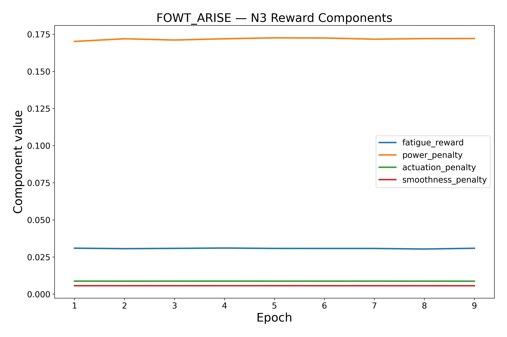

*Real output of FOWT_ARISE_Proposed_Model.ipynb on the real dataset — SHORT RUN (16-epoch cap), not final results*

<sub>N3 reward components per epoch: fatigue benefit, power penalty, actuator duty, smoothness.</sub>

---

### robustness loss

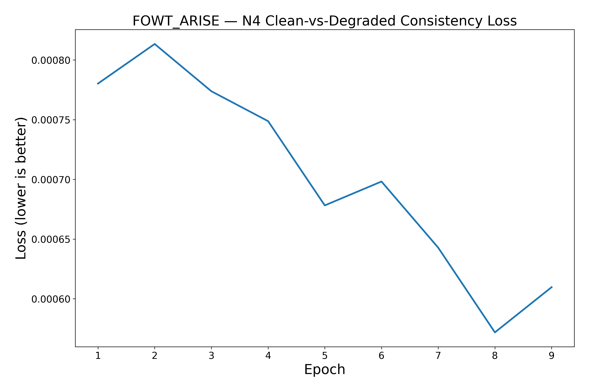

*Real output of FOWT_ARISE_Proposed_Model.ipynb on the real dataset — SHORT RUN (16-epoch cap), not final results*

<sub>N4 clean-vs-degraded consistency loss per epoch.</sub>

---

### objective comparison

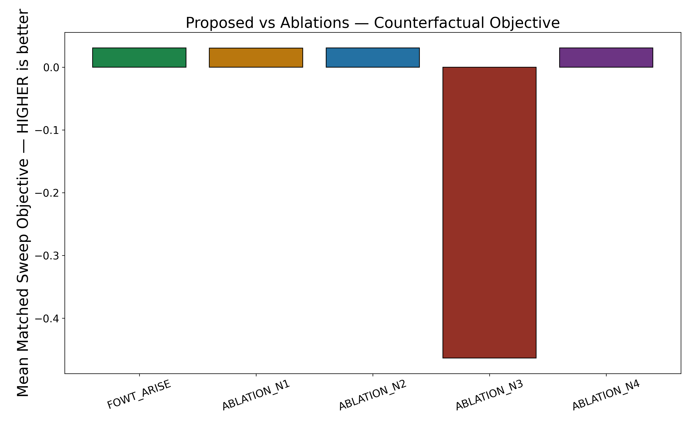

*Real output of FOWT_ARISE_Proposed_Model.ipynb on the real dataset — SHORT RUN (16-epoch cap), not final results*

<sub>Primary objective across the proposed model and all four ablations.</sub>

---

### pct of oracle

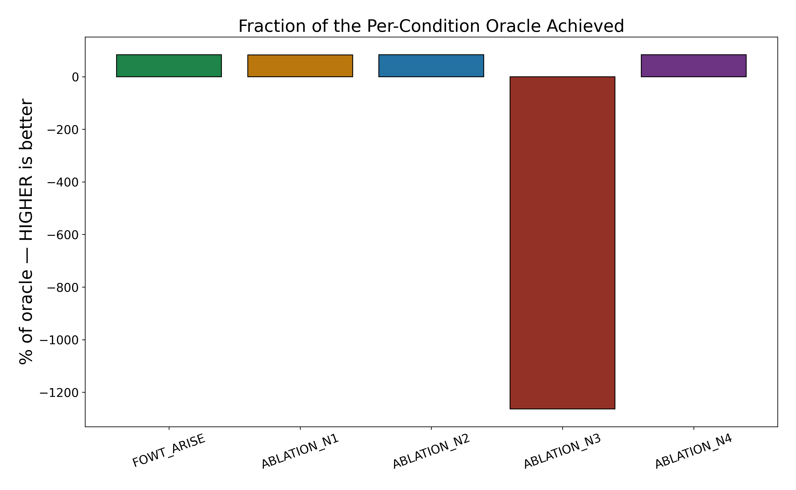

*Real output of FOWT_ARISE_Proposed_Model.ipynb on the real dataset — SHORT RUN (16-epoch cap), not final results*

<sub>Fraction of the per-condition oracle achieved. The oracle is the ceiling for any policy restricted to the 75-action sweep grid.</sub>

---

### del ratio

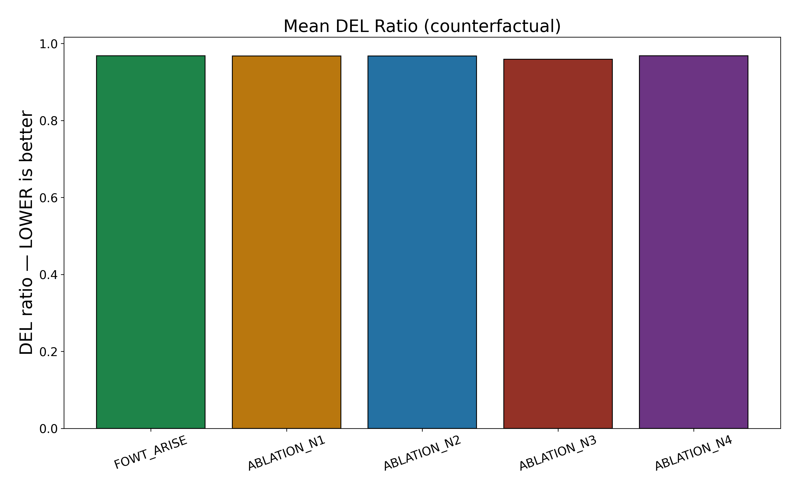

*Real output of FOWT_ARISE_Proposed_Model.ipynb on the real dataset — SHORT RUN (16-epoch cap), not final results*

<sub>Mean DEL ratio (LOWER is better).</sub>

---

### fatigue relief

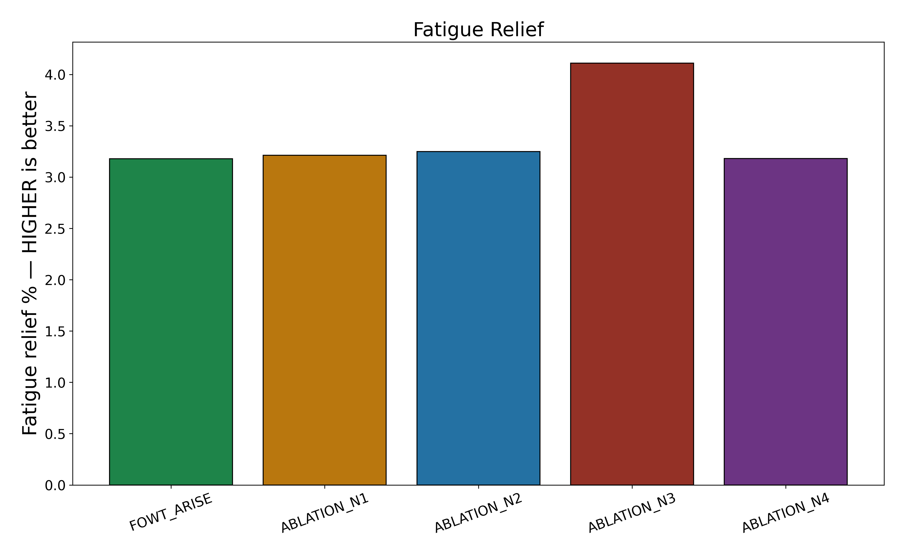

*Real output of FOWT_ARISE_Proposed_Model.ipynb on the real dataset — SHORT RUN (16-epoch cap), not final results*

<sub>Fatigue relief % (HIGHER is better).</sub>

---

### power loss

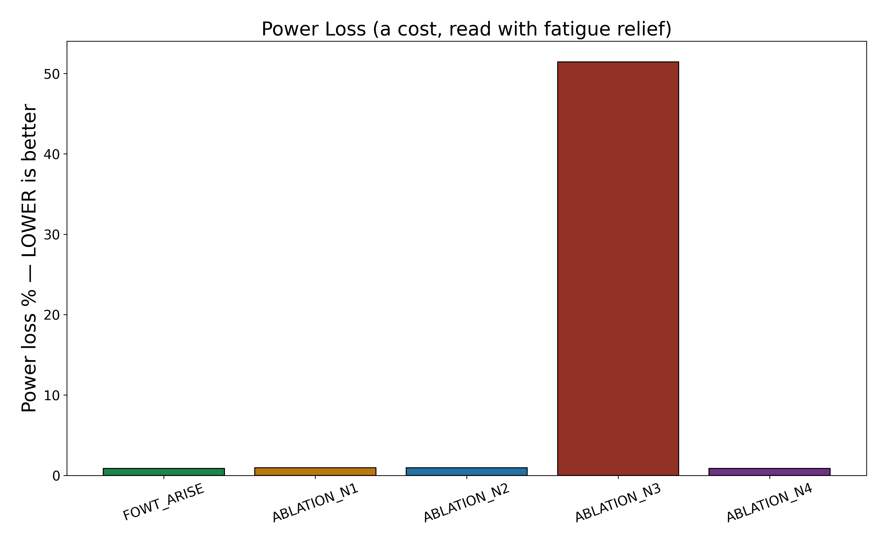

*Real output of FOWT_ARISE_Proposed_Model.ipynb on the real dataset — SHORT RUN (16-epoch cap), not final results*

<sub>Power loss % (LOWER is better). Read jointly with fatigue relief, never in isolation.</sub>

---

### fatigue power tradeoff

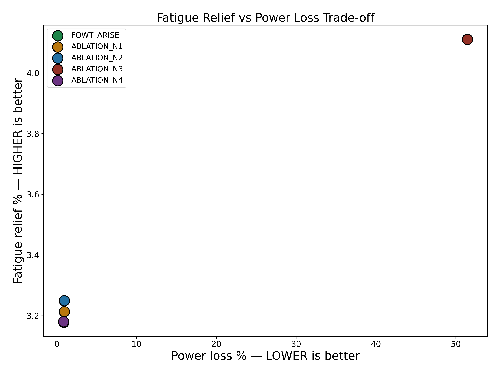

*Real output of FOWT_ARISE_Proposed_Model.ipynb on the real dataset — SHORT RUN (16-epoch cap), not final results*

<sub>Fatigue relief against power loss. Ablation N3 sits far right: removing the multi-objective reward buys fatigue relief by feathering and pays ~51% of rated power for it.</sub>

---

### no action rate

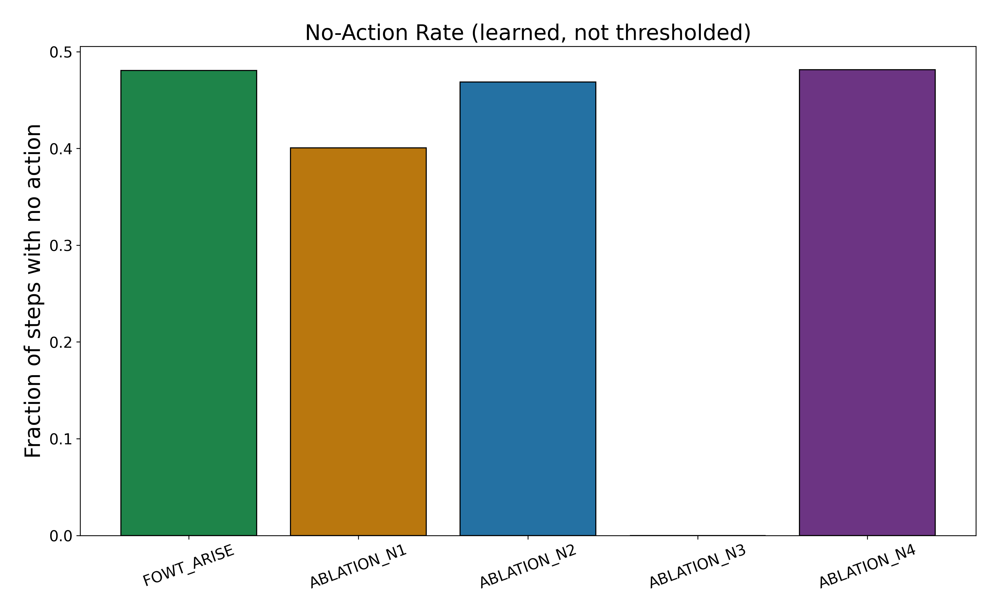

*Real output of FOWT_ARISE_Proposed_Model.ipynb on the real dataset — SHORT RUN (16-epoch cap), not final results*

<sub>Learned no-action rate (N2). Not a threshold — it emerges from the control-authority gate.</sub>

---

### robustness drop

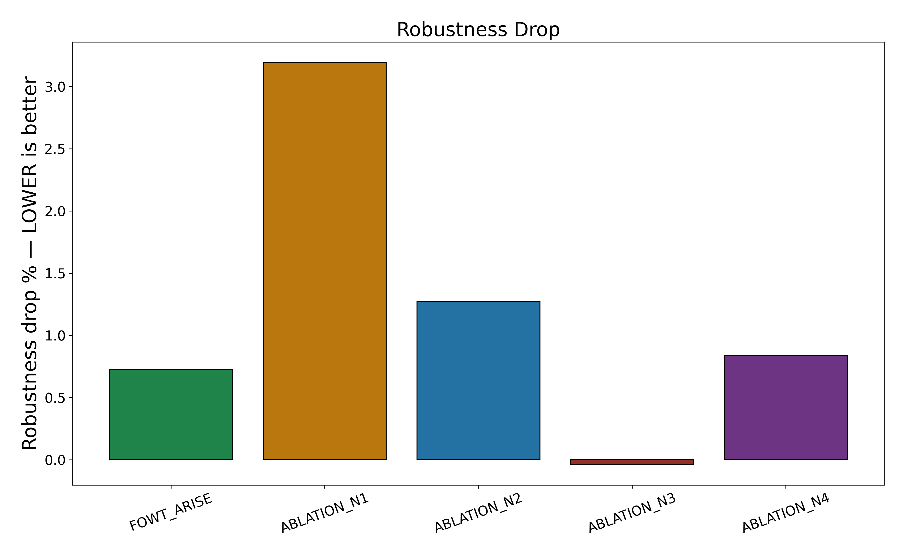

*Real output of FOWT_ARISE_Proposed_Model.ipynb on the real dataset — SHORT RUN (16-epoch cap), not final results*

<sub>Robustness drop % under combined IoT degradation (LOWER is better).</sub>

---

### action shift by mode

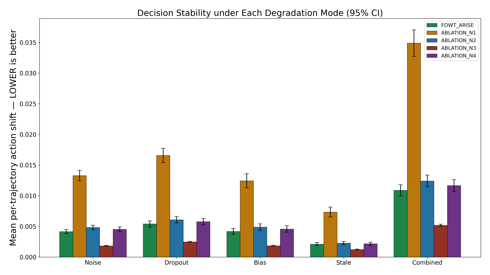

*Real output of FOWT_ARISE_Proposed_Model.ipynb on the real dataset — SHORT RUN (16-epoch cap), not final results*

<sub>Decision stability per degradation mode, with 95% CIs. The behaviour-based robustness view.</sub>

---

### paired objective difference

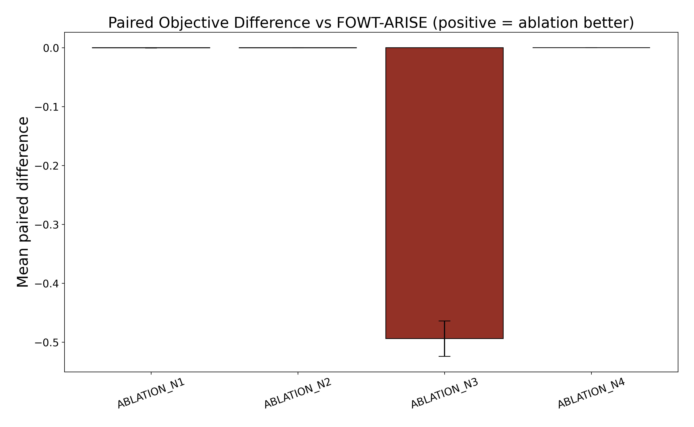

*Real output of FOWT_ARISE_Proposed_Model.ipynb on the real dataset — SHORT RUN (16-epoch cap), not final results*

<sub>Paired trajectory-level objective difference vs FOWT-ARISE, with 95% CIs.</sub>

---

### paired robustness difference

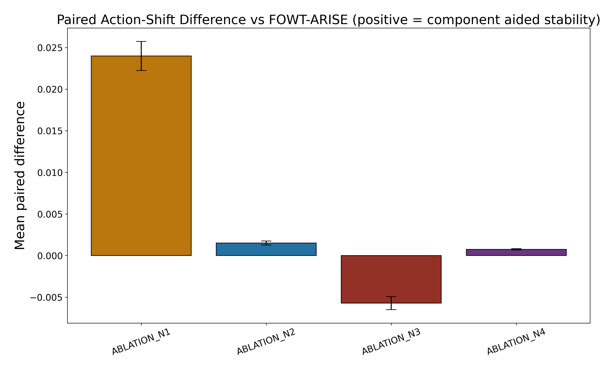

*Real output of FOWT_ARISE_Proposed_Model.ipynb on the real dataset — SHORT RUN (16-epoch cap), not final results*

<sub>Paired action-shift difference vs FOWT-ARISE. Positive means removing the component made the policy less stable, i.e. the component was contributing.</sub>

---

### shap importance

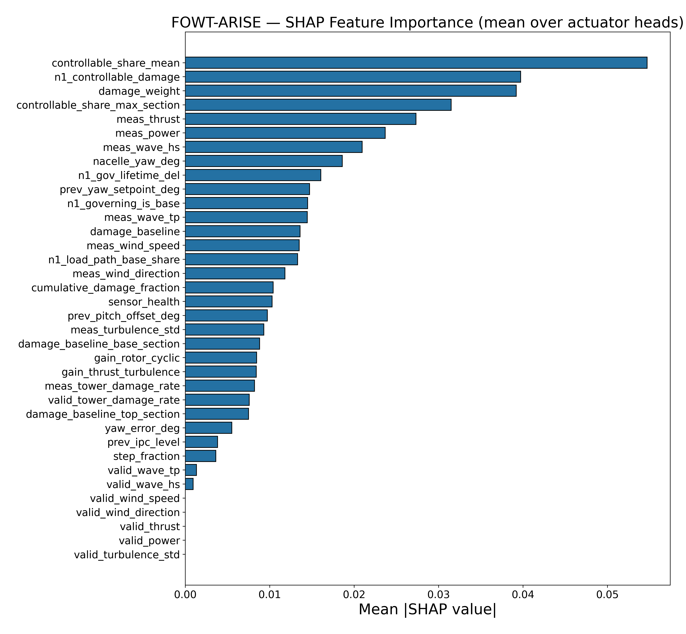

*Real output of FOWT_ARISE_Proposed_Model.ipynb on the real dataset — SHORT RUN (16-epoch cap), not final results*

<sub>SHAP feature importance, mean over the three actuator heads. Real SHAP on the real (short-run) model: background from TRAIN, explained rows from TEST.</sub>

---

### shap beeswarm

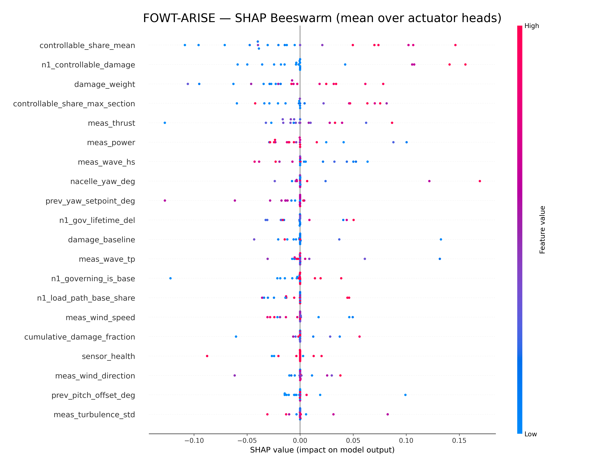

*Real output of FOWT_ARISE_Proposed_Model.ipynb on the real dataset — SHORT RUN (16-epoch cap), not final results*

<sub>SHAP beeswarm, mean over actuator heads.</sub>

---

### shap pitch

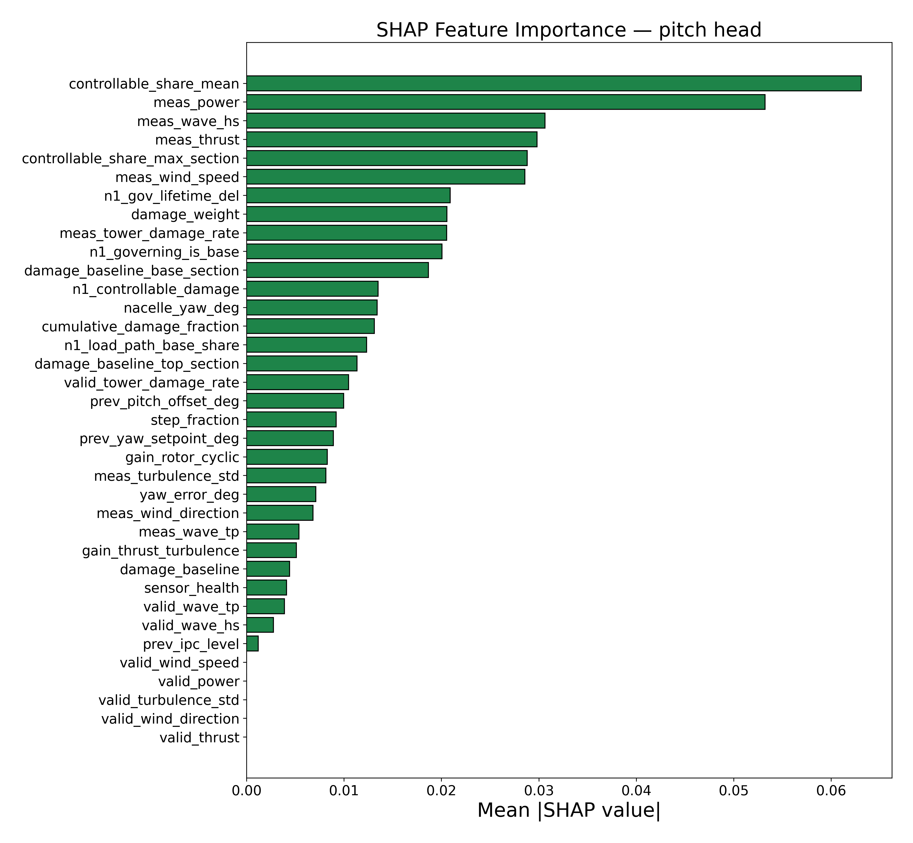

*Real output of FOWT_ARISE_Proposed_Model.ipynb on the real dataset — SHORT RUN (16-epoch cap), not final results*

<sub>SHAP importance for the pitch head alone.</sub>

---

### mean reward

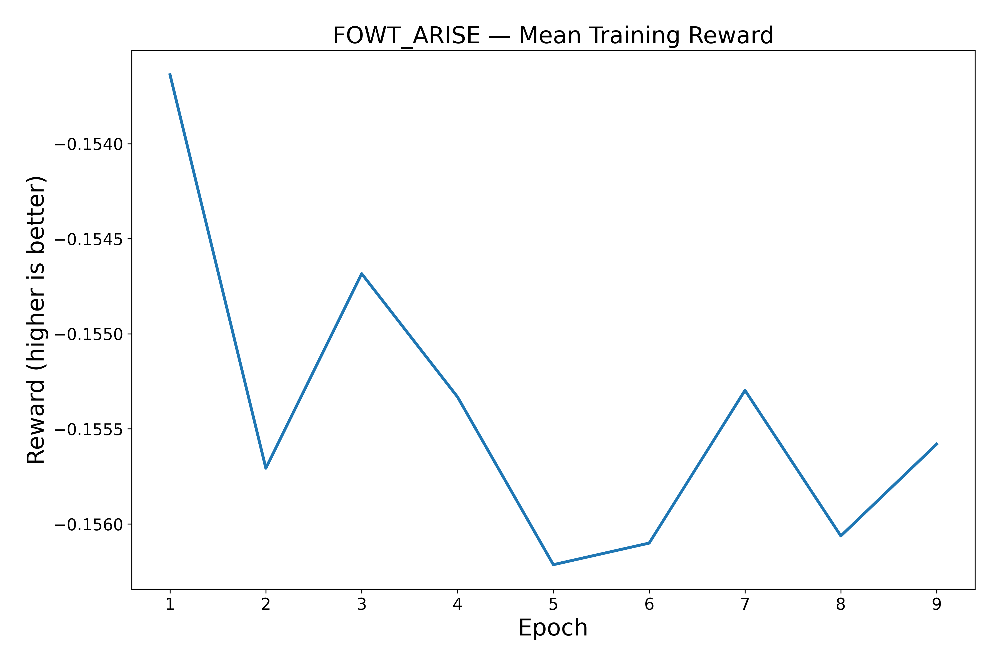

*Real output of FOWT_ARISE_Proposed_Model.ipynb on the real dataset — SHORT RUN (16-epoch cap), not final results*

<sub>Mean training reward per epoch.</sub>

---

## 8. Recommended next step

Fix the diverging critic (`RESOURCE_PLAN.md` §8 — a `GAMMA` change, zero compute cost), then
run the 3-seed study. Budget **30 minutes of L4 time**. That converts the currently unresolved
N1 / N2 / N4 comparisons into an answer and produces the final numbers for this table.